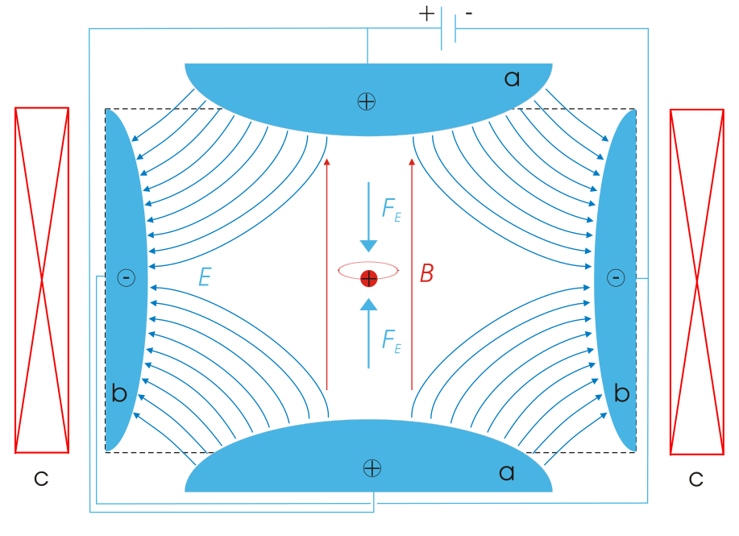

|:--:|
| <b>This illustration is by Arian Kriesch</b>|
# penning_trap
A Penning trap is a device for the storage of charged particles using a homogeneous axial magnetic field and an inhomogeneous quadrupole electric field. How can we simulate this device with numerical methods?